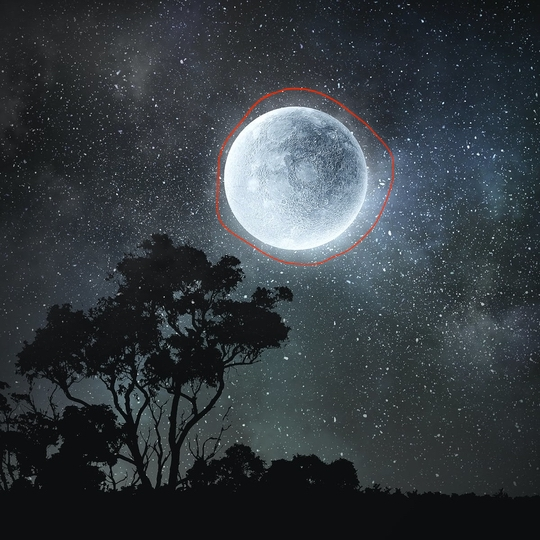
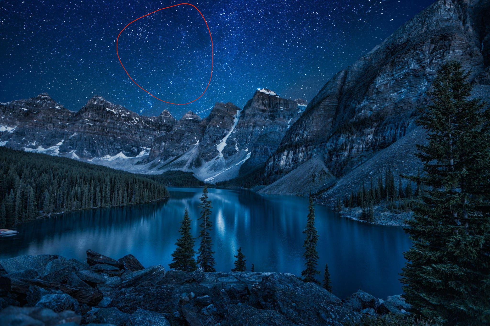
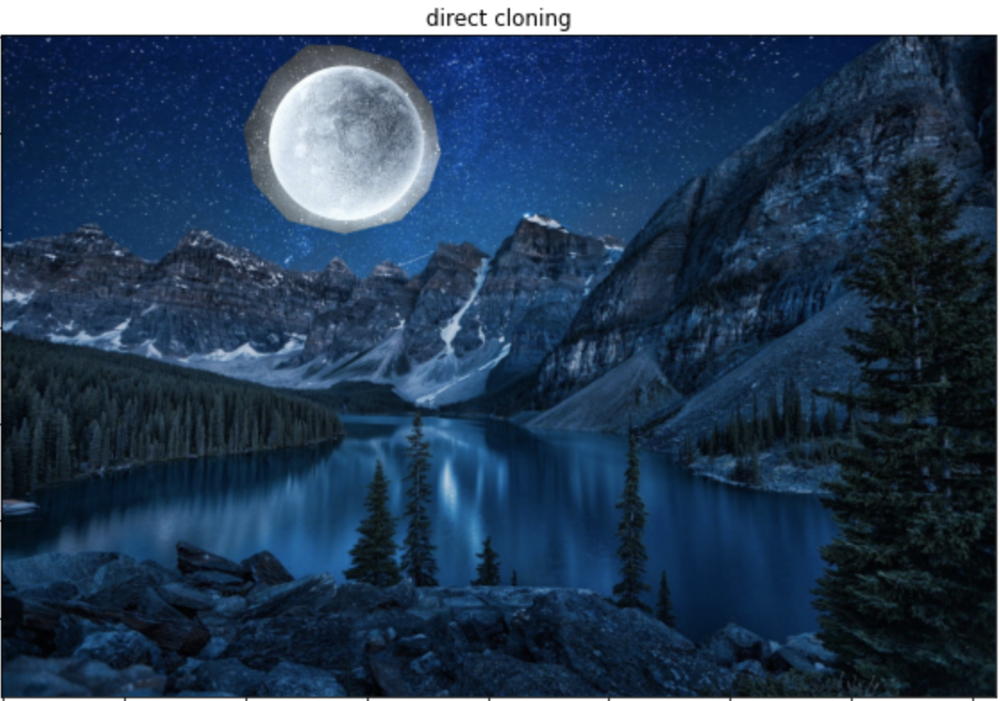
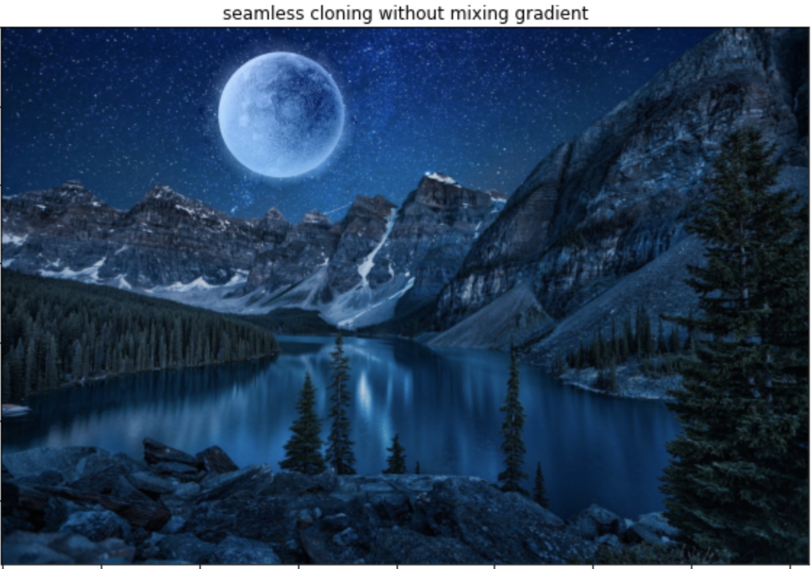

# Poisson-Image-Editing

If we want to crop a part from the source image and put it on another image directly, the problem is that we can clearly notice the change in gradient and the output image will not look natural. Therefore, this project use poisson image editing to clone a part from the source image to another image seamlessly.   

In the following demo, we try to crop the moon from the source image, and paste it on the original image.  
Source Image: 

  
Original Image: 

  
Direct Cloning: Cloning every pixels value of the cropped region directly from the source image, the output image will looks very unnatural.  

  
Seamless Cloning: Instead, we can import the gradient of the cropped region and fill in the pixels value on the output image using poisson equation to produce a more natural output image.   

